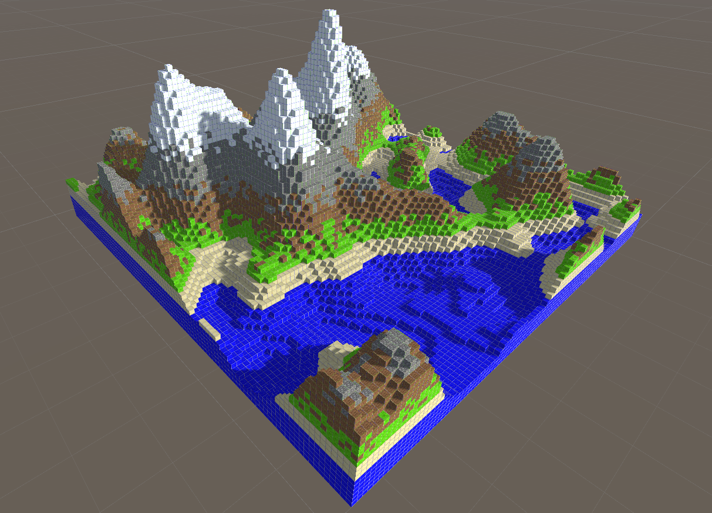
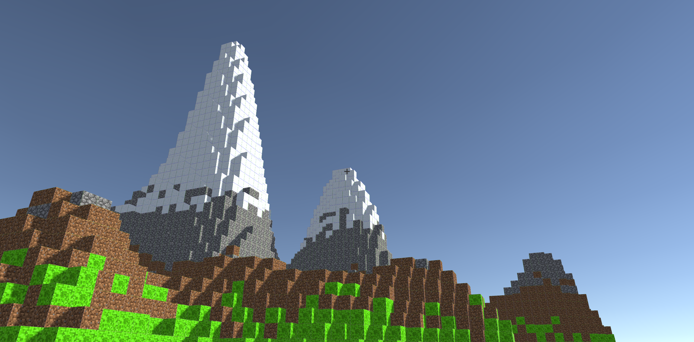
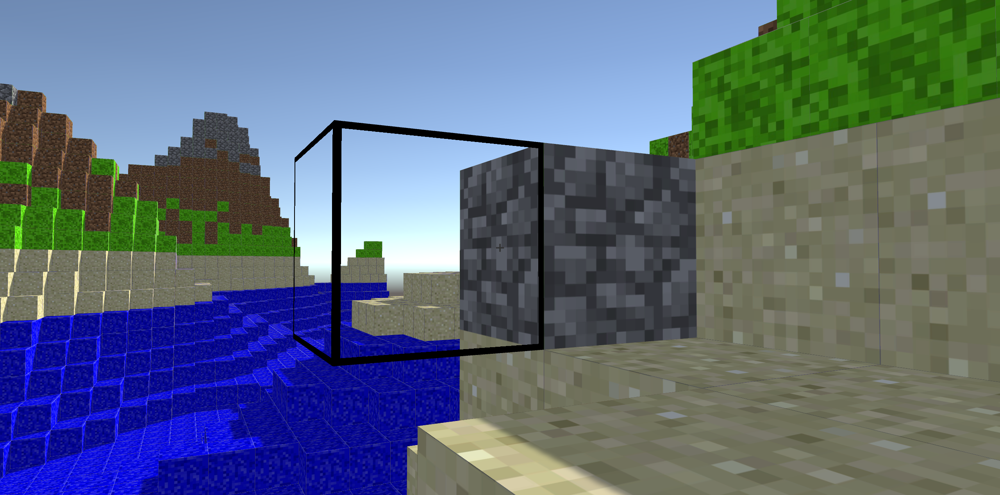
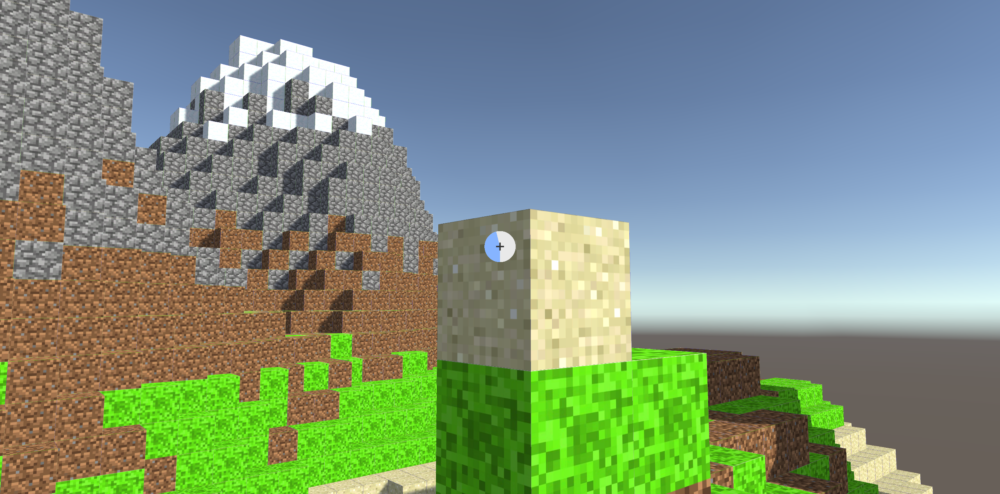

# Minecraft-like game
My implementation of a basic Minecraft-like game. The player is spawned in a randomly generated world with the ability to add and destroy surrounding blocks. Whenever the player leaves the world, a new one is generated. Furthermore, the player can save current game state and load it later from disk. 

## Controls
W S A D - player movement\
Space - jump\
B - on/off build mode\
1 2 3 4 - switch between block types\
Left mouse button - add block\
Right mouse button - destroy block (hold for time period)\
Esc - pause menu / resume

## Examples
Terrain generation using Perlin noise

Reshape the terrain by adding/destroying blocks

